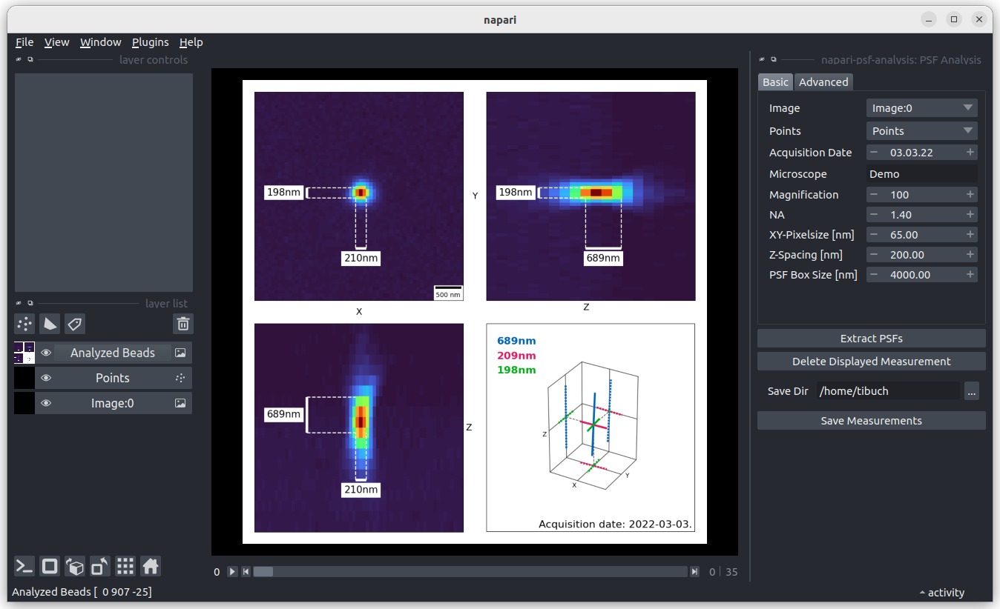

# napari-psf-analysis

This [napari] plugin was generated with [Cookiecutter] using [@napari]'s [cookiecutter-napari-plugin] template.

---

A plugin to analyse point spread funcitons (PSFs) of optical systems.

## Usage
### Starting Point
To run a PSF analysis open an image of acquired beads. Add a point-layer
and indicate the beads you want to measure by adding a point.

### Run Analyis
Open the plugin (Plugins > napari-psf-analysis > PSF Analysis) and ensure
that your bead image and point layers are select in the `Basic` tab under
`Image` and `Points` respectively.
In the `Advanced` tab further information can be provided. Only the filled
in fields of the `Advanced` tab are saved in the output.

After verifying all input fields click `Extract PSFs`.

### Discard and Save Measurement
Once the PSF extraction has finished a new layer (`Analyzed Beads`) appears,
holding a summary
image for every selected bead.
Individual summaries can be discarded by clicking the `Delete Displayed
Measurement` button.

Results are saved to the selected `Save Dir` by clicking the `Save
Measurements` button.

Note: Beads for which the bounding box does not fit within the image are
automatically excluded from the analysis and no output is generated.

### Saved Data
Every image of the `Analyzed Beads` layer is saved as `{source_image_name}_X
{bead-centroid-x}_Y{bead-centroid-y}_Z{bead-centroid-z}.png` file.
Additionally a `PSFMeasurement_{source_image_acquisition_date}_
{source_image_name}_{microscope_name}_{magnification}_{NA}.csv` file is
stored containing the measured values and all filled in fields.

---

## Installation

You can install `napari-psf-analysis` via [pip]:

    pip install napari-psf-analysis

## Contributing

Contributions are very welcome. Tests can be run with [tox], please ensure
the coverage at least stays the same before you submit a pull request.

## License

Distributed under the terms of the [BSD-3] license,
"napari-psf-analysis" is free and open source software

## Issues

If you encounter any problems, please [file an issue](https://github.com/fmi-faim/napari-psf-analysis/issues) along with a detailed description.

[napari]: https://github.com/napari/napari
[Cookiecutter]: https://github.com/audreyr/cookiecutter
[cookiecutter-napari-plugin]: https://github.com/napari/cookiecutter-napari-plugin
[@napari]: https://github.com/napari
[BSD-3]: http://opensource.org/licenses/BSD-3-Clause

[napari]: https://github.com/napari/napari
[tox]: https://tox.readthedocs.io/en/latest/
[pip]: https://pypi.org/project/pip/
[PyPI]: https://pypi.org/
