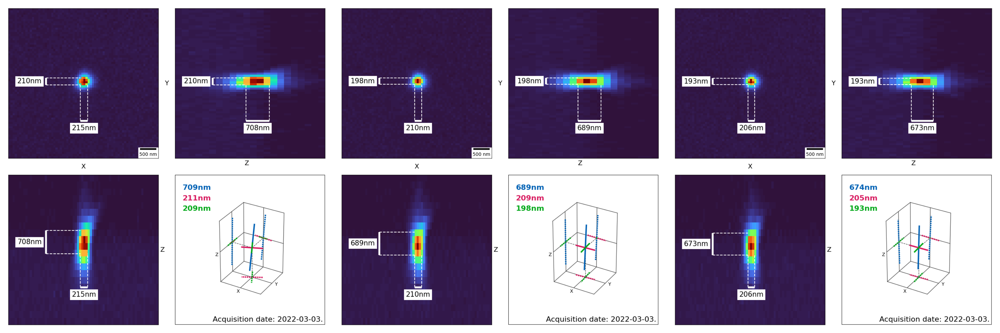

# napari-psf-analysis

[](https://opensource.org/licenses/BSD-3-Clause)
[](https://pypi.org/project/napari-psf-analysis)
[](https://python.org)
[](https://github.com/fmi-faim/napari-psf-analysis/actions)
[](https://codecov.io/gh/fmi-faim/napari-psf-analysis)
[](https://napari-hub.org/plugins/napari-psf-analysis)

This [napari] plugin was generated with [Cookiecutter] using [@napari]'s [cookiecutter-napari-plugin] template.

---

A plugin to analyse point spread funcitons (PSFs) of optical systems.

## Usage
### Starting Point
To run a PSF analysis open an image of acquired beads. Add a point-layer
and indicate the beads you want to measure by adding a point.

### Run Analyis
Open the plugin (Plugins > napari-psf-analysis > PSF Analysis) and ensure
that your bead image and point layers are select in the `Basic` tab under
`Image` and `Points` respectively.
In the `Advanced` tab further information can be provided. Only the filled
in fields of the `Advanced` tab are saved in the output.

After verifying all input fields click `Extract PSFs`.

### Discard and Save Measurement
Once the PSF extraction has finished a new layer (`Analyzed Beads`) appears,
holding a summary
image for every selected bead.
Individual summaries can be discarded by clicking the `Delete Displayed
Measurement` button.

Results are saved to the selected `Save Dir` by clicking the `Save
Measurements` button.

Note: Beads for which the bounding box does not fit within the image are
automatically excluded from the analysis and no output is generated.


### Saved Data
Every image of the `Analyzed Beads` layer is saved as `{source_image_name}_X
{bead-centroid-x}_Y{bead-centroid-y}_Z{bead-centroid-z}.png` file.
Additionally a `PSFMeasurement_{source_image_acquisition_date}_
{source_image_name}_{microscope_name}_{magnification}_{NA}.csv` file is
stored containing the measured values and all filled in fields.

For the demo gif above the following table is saved:

|ImageName               |Date      |Microscope|Magnification|NA |Amplitude        |Amplitude_2D      |Background        |Background_2D     |X                 |Y                 |Z                 |X_2D             |Y_2D              |FWHM_X            |FWHM_Y            |FWHM_Z           |FWHM_X_2D         |FWHM_Y_2D         |PrincipalAxis_1  |PrincipalAxis_2   |PrincipalAxis_3   |PrincipalAxis_1_2D|PrincipalAxis_2_2D|SignalToBG        |SignalToBG_2D     |XYpixelsize|Zspacing|cov_xx           |cov_xy            |cov_xz            |cov_yy           |cov_yz            |cov_zz           |cov_xx_2D        |cov_xy_2D         |cov_yy_2D        |sde_peak         |sde_background      |sde_X               |sde_Y              |sde_Z              |sde_cov_xx        |sde_cov_xy        |sde_cov_xz        |sde_cov_yy        |sde_cov_yz        |sde_cov_zz        |sde_peak_2D      |sde_background_2D   |sde_X_2D            |sde_Y_2D           |sde_cov_xx_2D      |sde_cov_xy_2D     |sde_cov_yy_2D     |version                      |Objective_id|PSF_path                                                   |
|------------------------|----------|----------|-------------|---|-----------------|------------------|------------------|------------------|------------------|------------------|------------------|-----------------|------------------|------------------|------------------|-----------------|------------------|------------------|-----------------|------------------|------------------|------------------|------------------|------------------|------------------|-----------|--------|-----------------|------------------|------------------|-----------------|------------------|-----------------|-----------------|------------------|-----------------|-----------------|--------------------|--------------------|-------------------|-------------------|------------------|------------------|------------------|------------------|------------------|------------------|-----------------|--------------------|--------------------|-------------------|-------------------|------------------|------------------|-----------------------------|------------|-----------------------------------------------------------|
|100x_1_conf488Virtex.tif|2022-03-03|Microscope|100          |1.4|4969.668887708917|5337.819377008636 |108.68118565810401|112.06260978398689|3304.2501743562757|3250.4033761925416|3065.7405670931444|3298.302439467146|3250.4113027135386|200.8139074557401 |197.03885411472754|674.9482557309917|183.72294307475494|176.22103947242965|675.8518951846926|199.23103476771948|195.54256297143823|184.93322114936828|174.9505023717054 |45.72703966759075 |47.63247426860641 |65.0       |200.0   |7272.305680278791|199.51201664296516|3544.234164883923 |7001.454943429444|1986.6819006579824|82153.39409342635|6087.112657801992|213.67205054291261|5600.155281533672|4.505314027916024|0.020623059963186995|0.06914746933299017 |0.06784783324982839|0.23241058486654181|11.794695129256654|8.185734859446441 |28.322224373959276|11.355300093289646|27.596443942593737|133.24416529759324|4.505314027916024|0.020623059963186995|0.06914746933299017 |0.06784783324982839|0.23241058486654181|11.794695129256654|8.185734859446441 |0.2.2.dev0+g1cb747a.d20221017|obj_1       |./100x_1_conf488Virtex.tif_Bead_X3304.3_Y3250.4_Z3065.7.png|
|100x_1_conf488Virtex.tif|2022-03-03|Microscope|100          |1.4|6131.783156459655|7007.7128858909955|108.97903673830632|112.03049813071806|3283.1815179892947|3369.970476029713 |3032.554247929097 |3276.851481699453|3370.657390994046 |210.4996203597178 |197.86302004157108|689.3745507955736|190.91529553428666|174.67418701487333|689.6867779885374|209.54607959880923|197.78706972073468|190.9553524915874 |174.63039550165533|56.265712562536564|62.55183189236865 |65.0       |200.0   |7990.743418986118|71.21282284528938 |2449.8383466578707|7060.148226446074|195.46702412069595|85702.80681598671|6573.035837695339|54.41831030118964 |5502.271462869397|4.621842915212504|0.02204379426143539 |0.060262260154465876|0.05664426296450384|0.19735347823753954|10.774935265711402|7.1611338777206415|25.058014334542662|9.520360761496262 |23.451758416706767|115.56192359712198|4.621842915212504|0.02204379426143539 |0.060262260154465876|0.05664426296450384|0.19735347823753954|10.774935265711402|7.1611338777206415|0.2.2.dev0+g1cb747a.d20221017|obj_1       |./100x_1_conf488Virtex.tif_Bead_X3283.2_Y3370.0_Z3032.6.png|
|100x_1_conf488Virtex.tif|2022-03-03|Microscope|100          |1.4|5619.498212394354|5796.371864919072 |108.65622592515462|111.58266064326322|3091.108753635228 |3279.722510310466 |3076.2986816645853|3084.318731921503|3278.6653904046307|214.82526951473534|210.45093794302085|708.1707538388272|205.59236614714763|202.64724874262387|709.557918556187 |211.60340602370195|209.0379608329753 |206.12587984384623|202.10455239686695|51.718142835783915|51.946887011866814|65.0       |200.0   |8322.52833820903 |217.27766177392047|4878.624412287828 |7987.047795051033|2326.0083470459012|90439.99432189878|7622.519106230307|100.7865902930646 |7405.697623587783|4.830591872545995|0.0241438047271005  |0.07013922523759801 |0.06871098346239177|0.23121554192278806|12.798834896781521|8.867905979672457 |30.29851519735856 |12.282968059322448|29.332165284940636|139.08589313352223|4.830591872545995|0.0241438047271005  |0.07013922523759801 |0.06871098346239177|0.23121554192278806|12.798834896781521|8.867905979672457 |0.2.2.dev0+g1cb747a.d20221017|obj_1       |./100x_1_conf488Virtex.tif_Bead_X3091.1_Y3279.7_Z3076.3.png|


With the three summary images:



---

## Installation
We recommend installation into a fresh conda environment.

### 1. Install napari
```shell
conda create -y -n psf-analysis -c conda-forge python=3.9

conda activate psf-analysis

python -m pip install "napari[all]"
```

### 2. Install napari-aicsimageio and bioformats
Required if you want to open other files than `.tif` e.g. `.stk. `.

__Note:__ See [napari-aicsimageio](https://www.napari-hub.org/plugins/napari-aicsimageio) for more information about opening images.
```shell
conda install -c conda-forge openjdk

conda deactivate
conda activate psf-analysis

python -m pip install "bfio[bioformats]"
python -m pip install "aicsimageio[all]"
python -m pip install napari-aicsimageio
```

### 3. Install napari-psf-analysis
You can install `napari-psf-analysis` via [pip]:

```shell
python -m pip install napari-psf-analysis
```

### 4. Optional `Set Config`
You can provide a config yaml file with the available microscope names and a default save directory.
This will change the `Microscope` text field to a drop down menu and change the default save directory.

`example_config.yaml`
```yaml
microscopes:
  - TIRF
  - Zeiss Z1
output_path: "D:\\psf_analysis\\measurements"
```

To use this config navigate to `Plugins > napari-psf-analysis > Set Config` and select the config file.

__Note:__ The save path is OS specific.

### 5. Desktop Icon for Windows
Follow [this](https://twitter.com/haesleinhuepf/status/1537030855843094529)
thread by Robert Haase.

## Contributing

Contributions are very welcome. Tests can be run with [tox], please ensure
the coverage at least stays the same before you submit a pull request.

## License

Distributed under the terms of the [BSD-3] license,
"napari-psf-analysis" is free and open source software

## Issues

If you encounter any problems, please [file an issue](https://github.com/fmi-faim/napari-psf-analysis/issues) along with a detailed description.

[napari]: https://github.com/napari/napari
[Cookiecutter]: https://github.com/audreyr/cookiecutter
[cookiecutter-napari-plugin]: https://github.com/napari/cookiecutter-napari-plugin
[@napari]: https://github.com/napari
[BSD-3]: http://opensource.org/licenses/BSD-3-Clause

[napari]: https://github.com/napari/napari
[tox]: https://tox.readthedocs.io/en/latest/
[pip]: https://pypi.org/project/pip/
[PyPI]: https://pypi.org/
